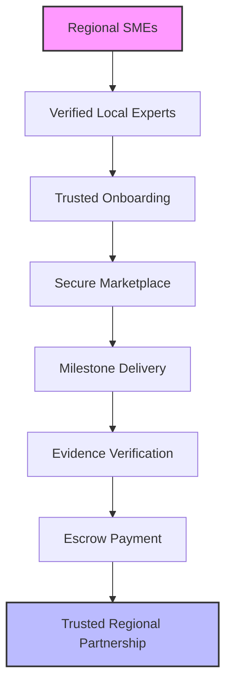
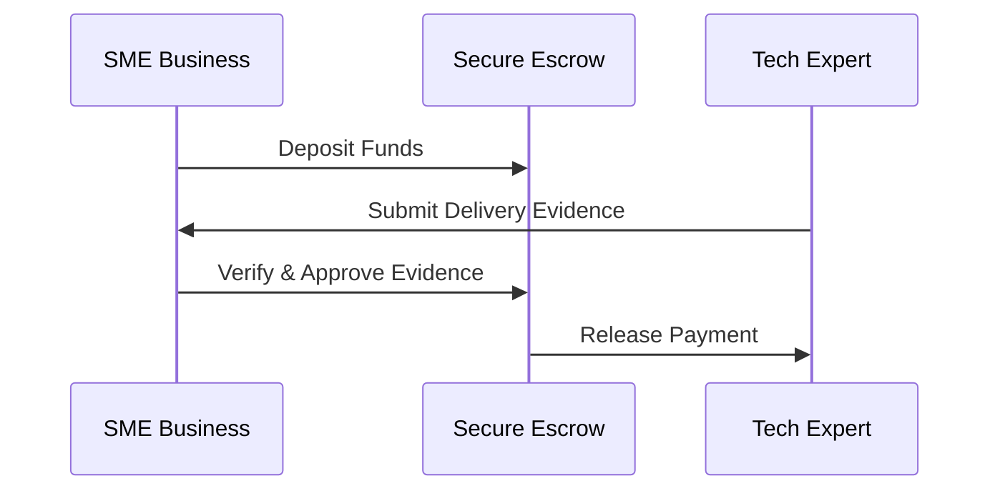
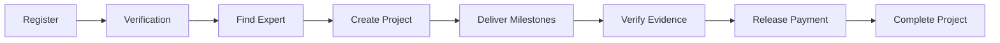

# 🚀 Hackathon Pitch Framework (AIM)

## 👥 Audience
**Regional businesses deserve trusted local digital expertise—not anonymous global marketplaces.** 

Regional SMEs often struggle to find reliable digital expertise without relying on expensive metropolitan agencies or high-risk offshore outsourcing. **Symbio Hub** is built specifically to connect regional businesses with trusted local professionals who understand their communities and business needs.

---

## 🎯 Intent
**By hosting a trusted digital marketplace, we connect regional businesses with verified local technology experts.** 

Symbio Hub simplifies the process of finding, engaging, and managing trusted digital talent through a secure, transparent platform designed for long-term regional partnerships.

---

## 📢 Key Messages

### 🌏 Regional-First Marketplace
Unlike global freelance marketplaces, **Symbio Hub focuses on regional businesses and verified local experts**, creating stronger community connections and better business outcomes.

### 🤝 Trust Before Transactions
Every project is backed by:
* **Verified trust profiles** to ensure authenticity.
* **Secure milestone-based escrow payments** to protect investments.
* **Evidence-based project delivery** for guaranteed results.

This ensures every participant knows what success looks like before any payment is released.

### 🔍 Transparent Delivery
Businesses can confidently monitor project progress through milestone evidence, giving them complete visibility before approving payments. Rather than relying on promises, Symbio Hub provides objective proof of completed work throughout the project lifecycle.

### 📈 Empowering Regional Growth
We're making trusted digital transformation accessible to every regional business by reducing project risk and connecting SMEs with proven local expertise.

---

## 💡 Why Symbio Hub?

> 💡 **Global freelance platforms connect people. Symbio Hub builds trusted regional partnerships.**

Most competitors optimise for **finding freelancers**. Symbio Hub optimises for **building trusted, long-term partnerships** between regional SMEs and verified technology experts.

---

# ⚖️ What Makes Symbio Hub Different?

### 🇦🇺 Regional SME Focus
Instead of competing globally, Symbio Hub prioritises regional Australian businesses, creating stronger local economies and fostering trusted community relationships.

### 🛡️ Verified Trust Profiles
Every expert is verified before joining the platform, providing businesses with confidence in who they're engaging.

### 📦 Evidence-Based Project Delivery
Projects are tracked through measurable milestones supported by delivery evidence, ensuring accountability throughout the engagement.

### 💳 Escrow Linked to Verified Work
Payments are securely held until agreed milestones have been completed and verified, protecting both businesses and technology experts.

### 🔄 End-to-End Workflow
Symbio Hub provides a unified platform covering the complete project lifecycle:
1. **Trusted onboarding**
2. **Expert discovery**
3. **Project marketplace**
4. **Milestone delivery**
5. **Evidence verification**
6. **Secure escrow settlement**
7. **Project completion**

---

# ⛓️ Our Trust Model

These capabilities are more than individual features—they form a unified trust model that differentiates Symbio Hub from traditional freelance marketplaces.

---

# 🎨 Product Image Concepts

### 1. Regional SME Focus
* **Title:** Regional Businesses. Local Experts.
* **Visual Concept:** A split illustration showing a regional Australian town and an SME owner successfully collaborating with verified local technology experts via a digital dashboard.

### 2. Verified Trust Profiles
* **Title:** Trust Starts With Verification
* **Visual Concept:** UI mockup of verified profile cards showcasing identity verification badges, skills certifications, and community trust rating indicators.

### 3. Evidence-Based Delivery
* **Title:** Every Milestone Backed By Evidence
* **Visual Concept:** A clean progress dashboard displaying a project timeline, completed milestones, and uploaded file deliverables.

### 4. Secure Escrow
* **Title:** Payments Released Only After Verified Delivery
* **Visual Concept:**

### 5. Unified Workflow
* **Title:** One Platform. Complete Project Lifecycle.
* **Visual Concept:**

---

# 💬 One-Sentence Value Proposition

> 🌟 **Symbio Hub is the trusted regional digital marketplace connecting businesses with verified local technology experts through secure, evidence-based project delivery.**
